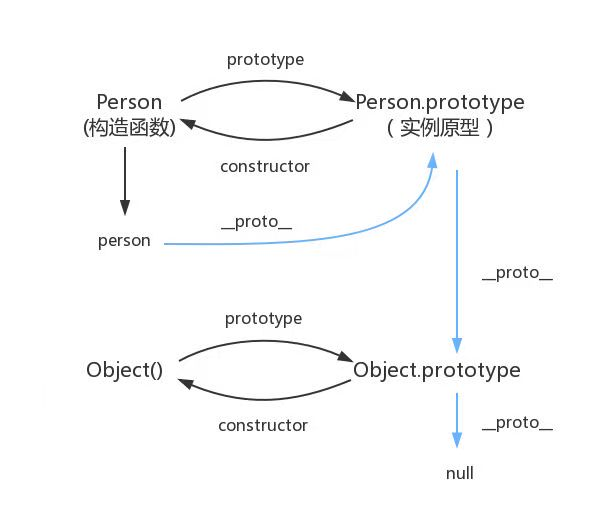

## 8.1 理解对象

### 8.1.7 对象解构

对象解构就是使用与对象相同的结构来实现对象属性的赋值。

```js
let person = {
  name: "Matt",
  age: 27,
};

let { name: personName, age: personAge } = person;
let { name, age } = person;

console.log(personName, personAge); // Matt,27
```

赋值的时候可以忽略某些属性，如果引用的属性不存在，则该变量就是 undefined

```js
let { name, job } = person;
console.log(job); // undefined
```

也可以在解构赋值的同时定义默认值

```js
let { name, job = "xxx" } = person;
console.log(job); // xxx
```

解构在内部使用函数 ToObject()（不能在运行环境访问）把源数据结构转换为对象。这意味着在对象解构的上下文中，原始值会被当成对象。这也意味着 null 和 undefined 不能被解构，否则会抛出错误

```js
let { constructor: c } = 4;
console.log(c === Number); // true

let { _ } = null; // TypeError

let { _ } = undefined; // TypeError
```

如果是给事先声明的变量赋值，则赋值表达式必须包含在一对括号内

```js
let pName, pAge;

({ name: pName, age: pAge } = person);
```

#### 1.嵌套解构

解构赋值可以使用嵌套结构，已匹配嵌套的属性

```js
let person = {
    name:'wt'
    age:27
    job:{
        title:'xxx'
    }
}

// 声明title变量 并将person.job.title赋值给它
let {job:{title}} = person
console.log(title) // xxx
```

在外层属性没定义的情况下不能使用嵌套解构，无论是原对象还是目标对象都一样

```js
// foo 在源对象上是undefined
let personCopy = {}
({foo:{bar:personCopy.bar}} = person) // 报错
```

#### 部分解构

多个属性的解构赋值是一个输出无关的顺序化操作，开始的赋值成功而后面的赋值出错，则整个解构赋值只会完成前面成功的部分

#### 参数上下文匹配

在函数参数列表中也可以解构赋值，不会影响arguments

## 8.2 创建对象

### 8.2.2 工厂模式

创建对象

```js
function createPerson(name,age,job) {
  let o = new Object()
  o.name = name
  o.age = age
  o.job = job
  o.sayName = function(){
    console.log(this.name)
  }
  return o
}

let person1 = createPerson('wt',27,'xxx')
```

### 8.2.3 构造函数模式

```js
function Person(name,age,job){
  this.name = name
  this.age = age
  this.job = job
  this.sayName = function(){
    console.log(this.name)
  }
}

let person1 = new Person('wt',26,'xxx')
let person2 = new Person('dd',20,'ddd')
person1.sayName() // xxx
person2.sayName() // ddd
```

Es的构造函数就是能创建对象的函数
**使用new操作符，调用构造函数会执行如下操作**

1. 在内存中创建一个新的对象
2. 这个新对象内部的[[prototype]]被赋值为构造函数的prototype属性
3. 构造函数内部的this被赋值为这个新对象（即this指向新对象）
4. 执行构造函数内部的代码（给新对象赋值）
5. 如果构造函数返回非空对象，则返回该对象。否则，返回刚创建的新对象。

person1和person2 分别保存着Person的不同实例，都有一个constructor的属性指向Person

```js
console.log(person1.constructor == Person) // true
console.log(person2.constructor == Person)  //true
```

#### 1. 构造函数也是函数

**构造函数和普通函数唯一的区别就是调用方式不同**，任何函数只要使用new操作符调用就是构造函数

在调用一个函数没有明确设置this值的情况下，this始终指向Global对象。(也可以理解为谁调用this就指向谁)

#### 2. 构造函数的问题

构造函数的主要问题在于，其定义的方法会在每个实例上都创建一遍。ES中的函数是对象，因此每次定义函数的时候，都会初始化一个对象。逻辑上讲构造函数实际上是这样的

```js
function Person(name,age,job){
  this.name = name
  this.age = age
  this.job = job
  this.sayName = new Function('console.log(this.name)')
}
```

因为都是做一件事，所以没必要定义两个不同的Function实例，况且 this对象可以把函数与对象的绑定推迟到运行时

```js
function Person(name,age,job){
  this.name = name
  this.age = age
  this.job = job
  this.sayName = sayName
}

function sayName(){
  console.log(this.name)
}

let person1 = new Person('wt',26,'xxx')
let person2 = new Person('dd',20,'ddd')
person1.sayName() // xxx
person2.sayName() // ddd
```

上面这种方式会把全局作用域搞乱

### 8.2.4 原型模式

每个函数都会创建一个prototype属性

```js
function Person(){}

Person.prototype.name = 'wt'
Person.prototype.sayName = function(){
  console.log(this.name)
}
let person1 = new Person()
person1.sayName() // wt
```

#### 1. 理解原型

无论何时，只要创建了一个函数，就会按照特定的规则为这个函数创建一个prototype属性(指向原型对象)。默认情况下，所有原型对象自动获得一名为constructor的属性，指回与之关联的构造函数。

```js
/*  
* 构造函数可以是函数表达式
* 也可以是函数声明
*    function Person(){}
*    let Person = function(){}
*/

function Person(){}

/* 声明之后，构造函数就有一个与之关联的原型对象 */
console.log(typeof Person.**prototype**)  // object
console.log(Person.prototype) 
/* 
{
  constructor: f Person(),
  [[Prototype]]: Object
}
*/

/* 
* 构造函数有一个prototype属性
* 引用其原型对象，而这个原型对象也有一个
* constructor属性，引用这个构造函数
* 换句话说，两者循环引用
*
* */
console.log(Person.prototype.constructor === Person) // true

/* 
* 正常的原型链都会终止于Object的原型对象
* Object原型的原型是null
*
*/
console.log(Person.prototype.__proto__ === Object.prototype) //true
console.log(Person.prototype.__proto__.constructor === Object) // true
console.log(Person.prototype.___proto__.__proto__ === null) // true

/* 
* 构造函数、原型对象和实例 是3个完全不同的对象
*
**/
let person1 = new Person()
    person2 = new Person()
console.log(person1 !== Person) // true
console.log(person1 !== Person.prototype) // true
console.log(Person.prototype !== Person) // true

/* 
* 实例通过__proto__链接到原型对象
* 他实际上指向隐藏特[[Prototype]]
*
* 构造函数通过prototype 属性链接到原型对象
* 实例与构造函数没有直接联系，与原型对象有直接联系
*/
console.log(person1.__proto__ === Person.prototype) // true
console.log(person1.__proto__.constructor === Person) // true

/* 同一个构造函数创建的两个实例，共享同一个原型对象 */
console.log(person1.__proto__ === person2.__proto__) // true

```

#### 2.原型层级

在通过对象访问属性时，会按照这个属性名开始搜索，搜索顺序为
当前实例-》原型对象，一直找到最顶层.

实例重写不了原型对象上的值，只会遮蔽原型对象上的同名属性

#### 3.原型和in操作符

in 操作符会在通过对象访问指定属性时返回true,无论该属性实在实例还是原型上

```js
 function Person(){}

 Person.prototype.name = 'wt'

 let person1 = new Person()
 let person2 = new Person()

 console.log('name' in person1) // true 


 person1.name = 'ww'
 console.log(person1.name) // ww ， 来自实例
 console.log('name' in person1) // true

```

### 8.2.5

#### 2. 原型的动态性

即使实例在修改原型之前已经存在，任何时候对原型对象所做的修改也会在实例上反应出来

```js
 let person1 = new Person()

 Person。prototype.sayHi = ()=>{
  console.log('hi')
 }

 person1.sayHi() // hi 
```

## 8.3 继承

实现继承(继承实际的方法)是es唯一支持的继承方式，主要通过原型链实现。

### 8.3.1 原型链



**原型链的基本构想：**
每个构造函数都有一个原型对象，原型有一个属性指回构造函数，而实例有一个内部指针指向原型。如果原型是另一个类型的实例，就意味着这原型本身有一个内部指针指向另一个原型，另一个原型也有一个属性指向另一个构造函数。

实现原型链如下代码所示

```js

function SuperType(){
  this.property = true
}

SuperType.prototype.getSuperValue = function(){
  return this.property
}

function SubType(){
  this.subProperty = false
}

// 继承SuperType
SubType.prototype = new SuperType()

SubType.prototype.getSubValue = function(){
  return this.subProperty
}

let instance = new SubType()
console.log(instance.getSuperValue) // true

```

注意：getSuperValue()方法还是在SuperType.prototype对象上，而property属性则在SubType.property上，因为getSuperValue()是一个原型方法，而 property是一个实例属性。SubType.prototype现在是SuperType的一个实例，所以 property 才会存储在他上面

#### 1. 默认原型

默认情况下，所有的引用类型都继承自Object,也是通过原型链实现的。**任何函数默认的原型都是一个Object的实例。**

#### 2. 原型与继承关系

原型与实例的关系可以通过instanceof操作符和isPrototype()方法来确定。

#### 3. 关于方法

以对象字面量方式({})创建原型方法会破坏之前的原型链。

#### 4. 原型链的问题

原型中包含的引用值会在所有的实例间共享，在使用原型实现继承时，原型实际上变成另一个类型的实例，这意味着原先的实例属性变成了原型属性。

```js
function SuperType(){
  this.colors = ['red','blue','green']
}

function SubType(){}

// 继承自 SuperType
SubType.prototype = new SuperType()

let instance1 = new SubType()
instance1.colors.push('black')
console.log(instance1.colors) // 'red','blue','green','black'

let instance2 = new SubType()
console.log(instance2.colors) // 'red','blue','green','black'

```

### 8.3.2 盗用构造函数
